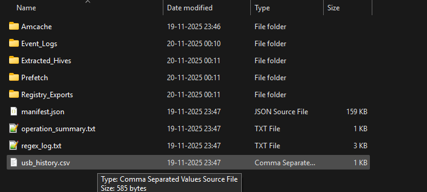

<!-- PROJECT HEADER -->

  
  
  
  

 

<!-- TITLE -->
<h1 align="center">🔍 RegEx Acquisition Engine (v1.0)</h1>
<h3 align="center">PowerShell-Based Windows Forensic Artifact Collector</h3>

  <b>Developed by Arnab Das</b> 
  Master’s Student, Cyber Forensics 
  National Forensic Sciences University  

 

---

# 📌 **Overview**

RegEx Acquisition Engine is a **forensic-grade PowerShell collection tool** designed for extracting critical Windows artifacts safely and systematically.  
It is engineered for:

- 🔒 **Live-system forensics**  
- 🛠 **WinPE / bootable forensic media**  
- 🚫 **Restricted Windows versions (VSS blocked)**  
- 🔍 **Evidence preservation with SHA256 hashing**

The tool creates a fully structured, integrity-verified evidence package ready for analysis using **RegEx-Analysis**.

---

# ✨ **Key Features**

### 🧩 **1. Forensic Artifact Extraction**
- SYSTEM / SAM / SECURITY / SOFTWARE / DEFAULT hives  
- User NTUSER.DAT + UsrClass.dat (best-effort live copy)  
- Event logs: System, Application, Security  
- USBSTOR + USB Enum metadata  
- Prefetch execution traces  
- Amcache program execution history  

---

### 🔐 **2. Integrity & Chain-of-Custody**
- SHA256 hashing for every artifact  
- Full `manifest.json` with metadata  
- `regex_log.txt` containing event logs  
- `operation_summary.txt` for documentation  

---

### ⚙️ **3. Engine Behavior**
- Auto-detection of VSS capability  
- Fallback mode using `reg save`, `wevtutil`, file copy  
- Zero writes to system drive  
- Clean artifact staging on external media  

---

# 🚀 **How to Use**

### **1️⃣ Open PowerShell as Administrator**
Required for registry + log extraction.

### **2️⃣ Run the script**

    PowerShell -NoProfile -ExecutionPolicy Bypass -File .\RegEx_Acquire.ps1

### **3️⃣ Documentation**

See the `/docs` folder:

- **features.md** — All features in detail  
- **artifacts_collected.md** — Artifact meaning & forensic value  
- **usage_examples.md** — Terminal usage screenshots  
- **limitations.md** — Known limitations of live acquisition  

---

### **4️⃣ Screenshot**

> A sample of the generated evidence structure produced by RegEx Acquisition Engine:

  

